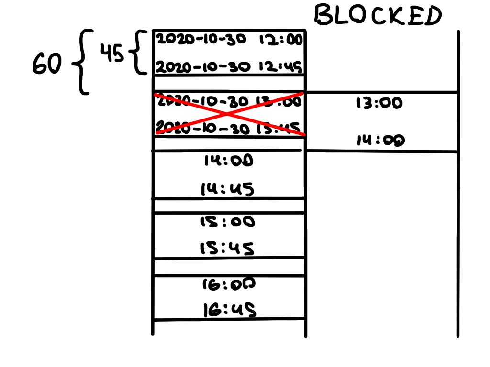

# `timeslotter`

> Time slot generation library

## Usage

```js
const { generateTimeSlots } = require("@georgenet/timeslotter");

const slots = generateTimeSlots(
  "2020-10-30T12:00:00Z",
  "2020-10-30T17:00:00Z",
  60,
  45,
  [{ start: "2020-10-30T13:00:00Z", end: "2020-10-30T14:00:00Z" }]
);
```

### Explanation
The code above generates these time slots



## Reference
Available in JSDoc format in `index.js` and as TypeScript typings in `index.d.ts`
